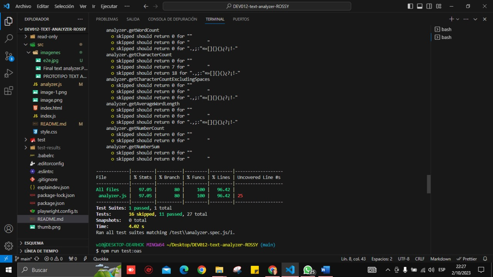
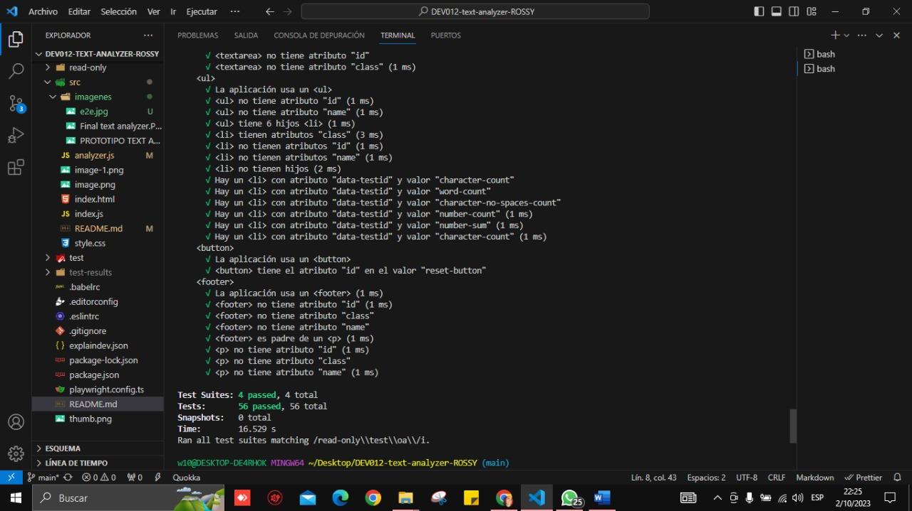
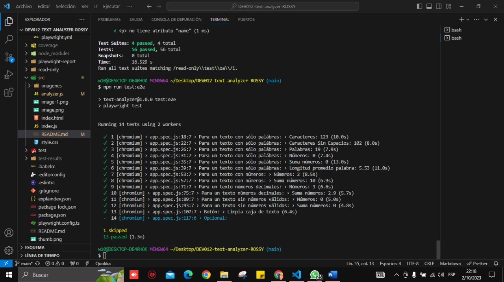

# Proyecto: "Text Analyzer"

Un analizador de texto es una aplicación para extraer información útil de un texto utilizando diversas técnicas, como el procesamiento del lenguaje natural (NLP), el aprendizaje automático (ML) y el análisis estadístico. Estas aplicaciones pueden proporcionar una variedad de métricas que brindan información básica sobre la longitud y la estructura del texto como por ejemplo, el conteo de palabras, el conteo de caracteres, el conteo de oraciones y el conteo de párrafos. Otras métricas incluyen el análisis de sentimientos, que utiliza técnicas de PNL para determinar el tono general positivo, negativo o neutral del texto, y el análisis de legibilidad, que utiliza algoritmos para evaluar la complejidad y la legibilidad del texto.

En general, las aplicaciones de análisis de texto brindan información valiosa y métricas sobre los textos que pueden ayudar a las usuarias a tomar decisiones informadas y sacar conclusiones significativas. Mediante el uso de estas herramientas de análisis, las usuarias pueden obtener una comprensión más profunda de los textos.

## 1. Prototipo del proyecto

Con mi prototipo buscaba sea parecido al ejemplo que nos brindaron al inicio del proyecto, simple, pero con varios estilos y que predominaran los colores neutros.

## 2. Proyecto terminado

Realize mi proyecto fiel al prototipo, en donde aplique sobre todo los bordes redondeados para todo el proyecto, y asi darle un estilo más bonito y llevado a mis preferencias personales.

## Funciones aplicadas en mi "TEXT ANALYZER"

### En JavaScript:
-	Función addEventListener, con su respectivo evento o función.
-	Metodos “.trim, .replace, .split, .filter, .match”
-	Expresiones regulares
-	Ciclos for y las condicionales if y else

### En CSS:
-	Estilos de palabras (Font-Family)
-	Background (image, repeat, size, color, etc)
-	Display (grid)
-	Place-items (para centrar elementos)
-	Border(radius, style, color, width)
-	Padding
-	Margin
-	Float (left)

### En HTML:
-	Etiquetas:
o	header
o	textarea
o	ul
o	li
o	button
o	div
o	footer
o	script
-	Atributos:
o	class
o	name
o	id

## Pruebas

### Pruebas unitarias:
Una prueba unitaria es una técnica de prueba de software en la que se comprueba que cada componente individual de un programa o sistema funciona correctamente de manera aislada. En otras palabras, se prueba cada unidad de código por separado para asegurarse de que cumple con los requisitos y especificaciones.

'npm run test'

### Pruebas de criterios mínimos de aceptación:
'npm run test:oas'

### Pruebas de extremo a extremo:
Una prueba de extremo a extremo (E2E) es una técnica de prueba de software en la que se verifica el funcionamiento de todo el sistema desde el inicio hasta el final. En otras palabras, se prueba el flujo completo del software, simulando la interacción del usuario con la aplicación, para asegurarse de que todas las partes del sistema funcionan correctamente en conjunto.

'npm run test:e2e'
