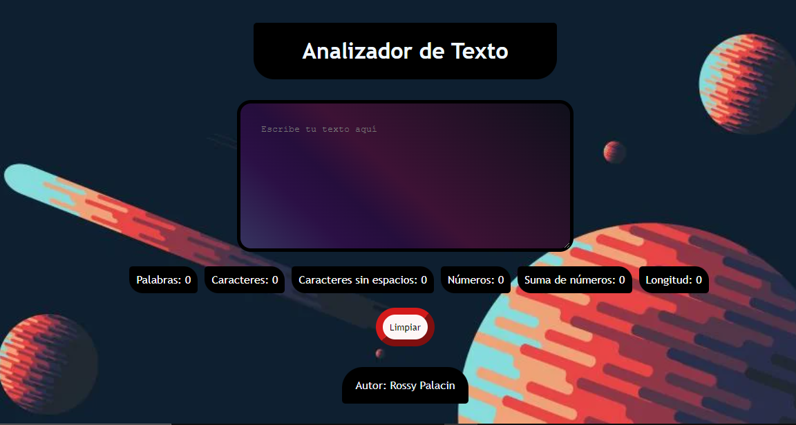

# Proyecto: "Text Analyzer"

Un analizador de texto es una aplicación para extraer información útil de un texto utilizando diversas técnicas, como el procesamiento del lenguaje natural (NLP), el aprendizaje automático (ML) y el análisis estadístico. Estas aplicaciones pueden proporcionar una variedad de métricas que brindan información básica sobre la longitud y la estructura del texto como por ejemplo, el conteo de palabras, el conteo de caracteres, el conteo de oraciones y el conteo de párrafos. Otras métricas incluyen el análisis de sentimientos, que utiliza técnicas de PNL para determinar el tono general positivo, negativo o neutral del texto, y el análisis de legibilidad, que utiliza algoritmos para evaluar la complejidad y la legibilidad del texto.

En general, las aplicaciones de análisis de texto brindan información valiosa y métricas sobre los textos que pueden ayudar a las usuarias a tomar decisiones informadas y sacar conclusiones significativas. Mediante el uso de estas herramientas de análisis, las usuarias pueden obtener una comprensión más profunda de los textos.

## 1. Prototipo del proyecto

Con mi prototipo buscaba sea parecido al ejemplo que nos brindaron al inicio del proyecto, simple, pero con varios estilos y que predominaran los colores neutros.

## 2. Proyecto terminado

Realize mi proyecto fiel al prototipo, en donde aplique sobre todo los bordes redondeados para todo el proyecto, y asi darle un estilo más bonito y llevado a mis preferencias personales.

## 3. Criterios de aceptación mínima aplicadas en el proyecto:

## HTML: Uso semántico de HTML

	La aplicación tiene un encabezado conformado por un <header> padre de un <h1> texto Analizador de texto. Para que puedas practicar más, estos elementos no pueden tener atributos id, ni name, ni class.

	La aplicación usa un <textarea> con un atributo nameen el valor user-inputpara permitir a la usuaria ingresar un texto. Para que puedas practicar más, este elemento no puede tener atributos id, ni class.

	La aplicación usa un <ul> con 6 hijos <li>, uno para mostrar cada métrica. Para que puedas practicar más, estos elementos no pueden tener atributos idni nameni hijos.

	El <li> para mostrar el recuento de palabras debe tener un atributo data-testidcon valor word-count.

	El <li> para mostrar el recuento de caracteres debe tener un atributo data-testidcon valor character-count.

	El <li> para mostrar el recuento de caracteres excluyendo espacios y signos de puntuación debe tener un atributo  data-testidcon valor character-no-spaces-count.

	El <li> para mostrar el recuento de números debe tener un atributo data-testidcon valor number-count.

	El <li> para mostrar la suma total de números debe tener un atributo data-testidcon valor number-sum.

	El <li> para mostrar la longitud media de las palabras debe tener un atributo data-testidcon valor word-length-average.

	La aplicación tiene un pie de página conformado por un <footer> que es padre de un 
 que tiene como texto el nombre de la estudiante desarrolladora de la aplicación. Para que puedas practicar más, estos elementos no pueden tener atributos id, ni name, ni class.

	La aplicación usa un <button> atributo iden el valor reset-buttonpara permitir a la usuaria, mediante un clic, limpiar el contenido de la caja de texto.

